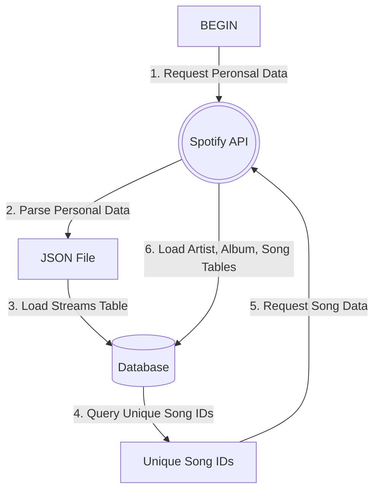
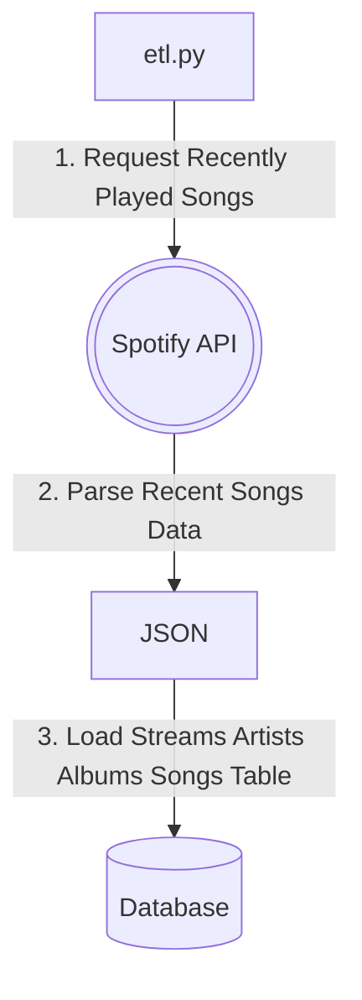

# Data Pipeline Project

## Summary
- I wanted to learn the concepts of a data pipeline. I also chose to use
trustworthy data by creating a process to keep track of my Spotify
listening history. Thus, I chose to make a pipeline containing my
streaming history using the Spotify API. Overall, it authenticates using
a token, requests my most recent 50 songs played and inserts them into a
Postgresql database. 

### Obstacles
- Authenticating through the Spotify proved to be challenging without
		using the third party framework Spotipy. I could not figure out how
		to authenticate without using the framework.

~~- I wanted to gather all songs streamed from the beginning of the year
		but I ran into issues using the **user-read-recently-played scope**
		endpoint within the Spotify API. Using both before and after
		parameters keep returning null results. Hopefully this issue is
		addressed in the near future, so I can go back and gather a full year
		of listening history.~~

### Successes
- I was able to download a year worth of streaming history by
		requesting personal data through Spotify. This returned four JSON
		files of music played within a calendar year. 

### Tools Used
- Cron
- Dotenv
- Matplotlib
- Numpy
- PostgreSQL
- Python
- Requests
- Spotify API
- Spotipy
- SQLAlchemy
- WordCloud

### What I Learned
- Fundamentals of data extraction, transformation and loading (ETL)
- How to work with the Spotify API
- More experience with PostgreSQL
- SQL triggers, aggregate functions, and, views.
- Making word clouds with mask images

### Images

#### Request Spotify Personal Data Flowchart

#### Spotify History Data Flowchart

#### Top artists word cloud

#### Top songs word cloud

